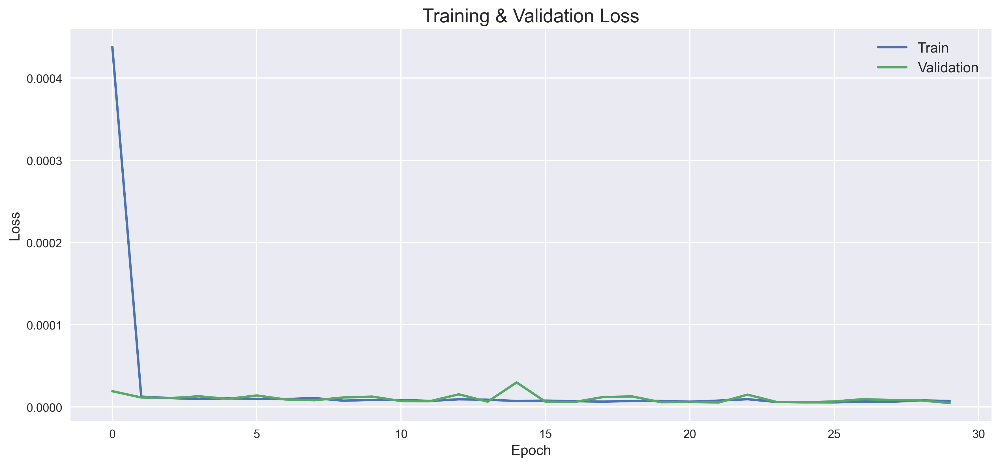
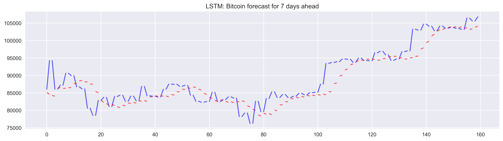

<h1 align="center">🧠 Bitcoin Price Prediction using LSTM</h1>

<p align="center">
  
  
  
  
</p>

---

## 📌 Overview

This project demonstrates a **clean and effective approach to predicting Bitcoin prices** using a Long Short-Term Memory (**LSTM**) neural network.

It includes the full pipeline:

- 📥 Fetching live Bitcoin market data  
- 🔧 Preprocessing & sequence generation  
- 🧠 LSTM model training  
- 📈 Visualization of predictions  
- 🧪 Comparison of actual vs. predicted prices  

Minimalistic, readable, and designed for real-world experimentation.

---

## 🖼️ Screenshots

### **Training & Validation Loss**
<p align="center">
  
</p>

### **Predicted vs Actual Bitcoin Price**
<p align="center">
  
</p>

---

## 🧩 Features

- Automatic BTC-USD historical data download (Yahoo Finance)
- Sliding window generator for time-series modeling
- Normalization & train/test split
- LSTM neural network optimized for sequence forecasting
- Clean visualizations for predictions
- Simple and extendable architecture

---

## 🧠 Model Architecture

```python
model = tf.keras.Sequential([
    tf.keras.layers.LSTM(64, return_sequences=True, input_shape=(seq_len, 1)),
    tf.keras.layers.LSTM(32),
    tf.keras.layers.Dense(16, activation='relu'),
    tf.keras.layers.Dense(pred_len)
])
```

## 🧑‍💻 Author

**Denys**  
Passionate about AI and computer vision.
Reach me at: [denys.zakharov.work@gmail.com]  

---
